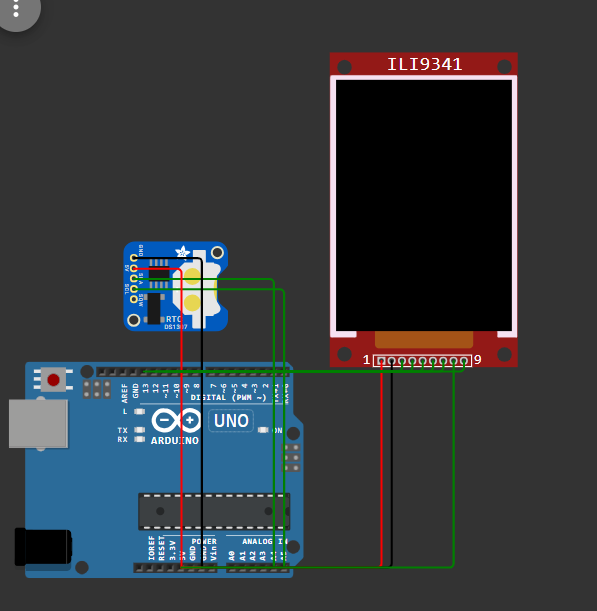

# Decimal-clock-
Time is traditionally measured using sexagesimal (base-60) units (hours:minutes:seconds), while most other measurements use decimal (base-10). This project is an Arduino-based decimal clock (with a Wokwi simulation) that adapts ancient Indian time units—Prahar (~hour), Muhurat (~minute), and Nimesha (~second)—into a modern decimal system for easier calculation.

## Proposed time unit
- 1 Muhurt = 100 Nimesha
- 1 Prahar = 100 Muhurut
- 1 Day = 10 Prahar

## Relation between proposed unit and current time unit
- 1 Nimesha = 0.864 second
- 1 Muhurt = 86.4 second
- 1 Prahar = 8640 second

## Components used to make digital decimal clock
- Arduino uno
- RTC (real time clock) DS1307
- LCD TFT Display ILI9341
- Jumper wires

## Libraries used
- RTClib
- Adafruit ILI9341
- Adafruit GFX Library

## Wiring (UNO)
**TFT (ILI9341 SPI)**
- CS → **D10**
- DC → **D8**
- RST → **D9**
- SCK → **D13**
- MOSI → **D11**
- MISO → **D12**
- VCC → **5V**
- GND → **GND**

**RTC (DS1307)**
- SDA → **A4**
- SCL → **A5**
- VCC → **5V**
- GND → **GND**

## Here is the link of Decimal clock

(https://wokwi.com/projects/446617480644897793)

## Screenshot

.png)

